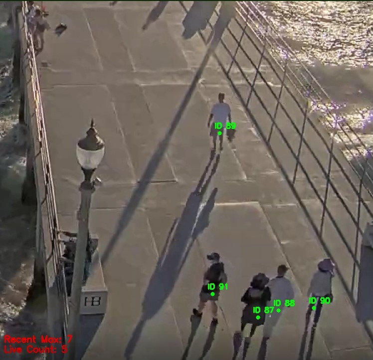
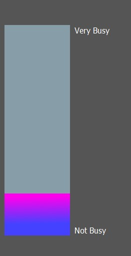

# BeachBusyness

This project uses OpenCV to count and track the number of people on screen from video livestream of the Huntington Beach pier. The count of people is used to update a GUI which displays how busy the pier is.

## Project in Action

Using OpenCV the program detects moving people, then tracks them untill they eventually leave the screen.
By default this screen isn't displayed to the user.

This GUI is displayed and updates about every 10 seconds

        

## Setup

* Download or clone repository
* pip install requirements.txt
* Run main.py and wait a few seconds for program to start up

* I believe the GUI might not work on Mac but that is untested

## Technologies
* Python 3.9
* OpenCV
* Pafy
* PyQt5

## Sources
This project is inspired by [this tutorial](https://pyimagesearch.com/2018/08/13/opencv-people-counter/)
